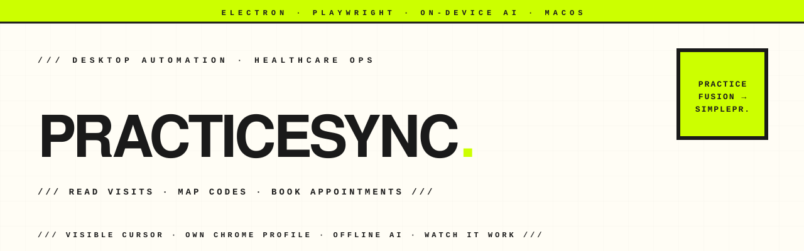

<p align="center">
  <picture>
    <source media="(prefers-color-scheme: dark)" srcset="assets-readme/hero-banner-dark.svg" />
    
  </picture>
</p>

<p align="center">
  <a href="https://github.com/hatimhtm/practicesync/actions/workflows/release.yml"></a>
  
  
  
  
  
</p>

<p align="center">
  <em><strong>PracticeSync</strong> (ships as <strong>Hope Assistant</strong>) — a macOS desktop app that reads each patient visit from <strong>Practice Fusion</strong> (name, date, diagnosing doctor) and books the matching coded appointment in <strong>SimplePractice</strong> under the correct main doctor, automatically. Electron + Playwright drive a dedicated Chrome profile so the operator's logins stay put and nothing is re-entered; a visible cursor narrates every step so a clinic can watch the work happen. The only AI runs on-device. Built as freelance client work for a mental-health practice; ~4.5k LOC, shipped.</em>
</p>

---

### `/// WHY IT EXISTS`

A clinic that runs on two systems pays for it twice. Visits live in **Practice Fusion**; billing and scheduling live in **SimplePractice**. Re-keying every patient — finding them, reading who they saw, picking the right main doctor, attaching the right billing codes — is slow, error-prone admin that someone does by hand every day.

PracticeSync does that exact loop. It opens **its own** Chrome window (a separate profile), so the operator's everyday browser stays untouched and no passwords are stored. You sign into each site once in that window and it stays signed in. You **teach it each screen once** (a red highlight follows the cursor while you point at the search box, the result, the fields), then it works by **patient name** — no URLs to paste. And you **watch it run**: a visible cursor glides to each field, types character by character, and clicks with a ripple, so the operator and their managers can see exactly what it did.

---

### `/// HIGHLIGHTS`

| | |
|---|---|
| **Read → map → book** | The engine pulls real visits from Practice Fusion, decides each appointment from the doctor roster, and creates it in SimplePractice (`src/main/automation.js`). A `dryRun` reads-and-plans without booking, so a run can be verified before it commits anything. |
| **Drives your own session** | Playwright launches the user's existing Chrome with a dedicated profile (`src/main/liveEngine.js`), reusing the logins and cookies already there — no new login, no stored credentials, no quitting your daily browser. |
| **Watch it work** | A visible cursor + status HUD is injected into the controlled window (the "stage"): the pointer moves, types, and clicks with a ripple while the app window mirrors every step as a live log. Built for clinic-floor trust, not headless speed. |
| **Teach each screen once** | Instead of brittle hard-coded selectors, the operator points at each element once with a cursor-following highlight; the app records selectors and replays them by patient name on every later run. |
| **On-device AI, never invents codes** | The only AI turns the free text you type about your doctors into a clean `doctor → {mainDoctor, codes[]}` roster (`src/main/ai.js`). Every model output is re-validated by a deterministic parser, so the AI can never invent a billing code. |
| **Three-tier AI fallback** | `auto` picks the smartest engine on the Mac: local **Gemma** via Ollama (`localhost:11434`, fully offline) → **Apple Intelligence** Foundation Models (Apple Silicon, macOS 26+, via a bundled Swift helper) → a deterministic built-in matcher that is always available offline. |
| **Built-in Test Drive** | A no-login demo: paste any web page (or pick a preset), and the *same* engine opens Chrome, reads the first table, and types each row — with the visible cursor — into a bundled spreadsheet. The mock-site demo (`npm run demo`) runs the whole read→map→book loop end-to-end with no internet. |
| **Ships & self-updates unsigned** | A version tag triggers `release.yml`, which builds the `.dmg` and the Apple Intelligence helper and publishes to GitHub Releases. The app checks for updates on launch and hands over the new `.dmg` (`src/main/updater.js`) — no code signing required. |

---

### `/// THE LOOP`

```
 Practice Fusion                  PracticeSync engine                 SimplePractice
 ┌──────────────┐    read     ┌──────────────────────────┐   book   ┌──────────────┐
 │ patient visit │ ─────────▶ │ extract.js  parse visits  │ ───────▶ │  coded appt   │
 │  name / date  │            │ model.js    doctor → main  │          │  under main   │
 │  diagnosing dr│            │             + billing codes│          │    doctor     │
 └──────────────┘            └──────────────────────────┘          └──────────────┘
        ▲                              │  ▲                                  │
        └──── dedicated Chrome profile ┘  │ on-device AI (Gemma/Apple/built-in)
              (Playwright, visible cursor)│ turns typed doctor list → roster
                                          │
                          deterministic re-validation — AI never invents a code
```

---

### `/// PROJECT STRUCTURE`

```
practicesync/
├── src/
│   ├── main/
│   │   ├── main.js          window, menu-bar tray, IPC, the sync run, auto-update wiring
│   │   ├── automation.js    engine: read visits → plan appointments → create them
│   │   ├── liveEngine.js    Playwright automation of a dedicated Chrome profile + the visible "stage"
│   │   ├── extract.js       pure DOM logic (selector building, visit extraction, form planning); unit-tested
│   │   ├── model.js         main doctors, doctor → {mainDoctor, codes[]} roster, fuzzy name matching
│   │   ├── ai.js            engine abstraction (Apple / local Gemma / built-in) + roster text parser
│   │   ├── scheduler.js     interval scheduler (6h / daily)
│   │   ├── updater.js       GitHub-release auto-update (works unsigned)
│   │   └── store.js         settings (atomic writes)
│   └── renderer/            UI — index.html / styles.css / app.js
├── demo/                    bundled mock sites + the recordable end-to-end demo
├── build/                   icon generator, Apple Intelligence Swift helper, UI screenshot harness
├── test/                    extract + parser unit tests + real-engine e2e
└── .github/workflows/       release.yml — tag → build → publish .dmg
```

---

### `/// LOCAL DEV`

```bash
npm install
npm start          # run the app (Electron)
npm test           # extract + parser unit tests + a real-engine end-to-end test
npm run demo       # the recordable demo — a Chrome window opens; watch the cursor
                   # HEADLESS=1 npm run demo  runs it as a test
```

Build a local installer:

```bash
npm run dist       # builds the Apple Intelligence helper, then dist/HopeAssistant-Installer.dmg
npm run make-icon  # regenerate the app + tray icons
```

The build is **unsigned**: it installs fine (right-click → **Open** the first time) but won't silently auto-update. Cut a release by pushing a tag:

```bash
npm version patch && git push --follow-tags
```

---

### `/// TECH`

`Electron 31` · `Playwright` · `Node.js` · `jsdom` · `Ollama (Gemma)` · `Apple Intelligence / Foundation Models (Swift)` · `electron-builder` · `macOS (Apple Silicon)`

---

### `/// STATUS`

Freelance client work, shipped to a mental-health practice as **Hope Assistant**. `UNLICENSED` and private by intent — this repository is a portfolio showcase of the build, not licensed for reuse or redistribution. No `LICENSE` file is included.

---

<p align="center">
  <a href="https://hatimelhassak.is-a.dev"></a>
  <a href="https://cal.com/hatimelhassak/engineering-discovery"></a>
  <a href="https://www.linkedin.com/in/hatim-elhassak/"></a>
  <a href="mailto:hatimelhassak.official@gmail.com"></a>
</p>

<p align="center">
  <code>///&nbsp;&nbsp;OPEN FOR NEW WORK&nbsp;&nbsp;///&nbsp;&nbsp;CONTRACT &amp; FREELANCE&nbsp;&nbsp;///&nbsp;&nbsp;REMOTE WORLDWIDE&nbsp;&nbsp;///</code>
</p>
